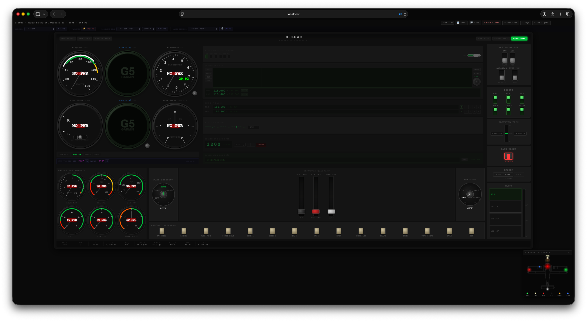
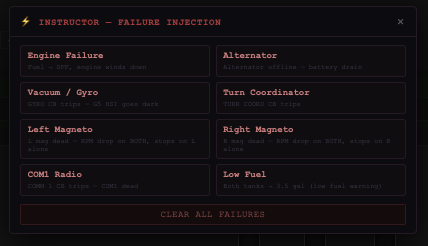
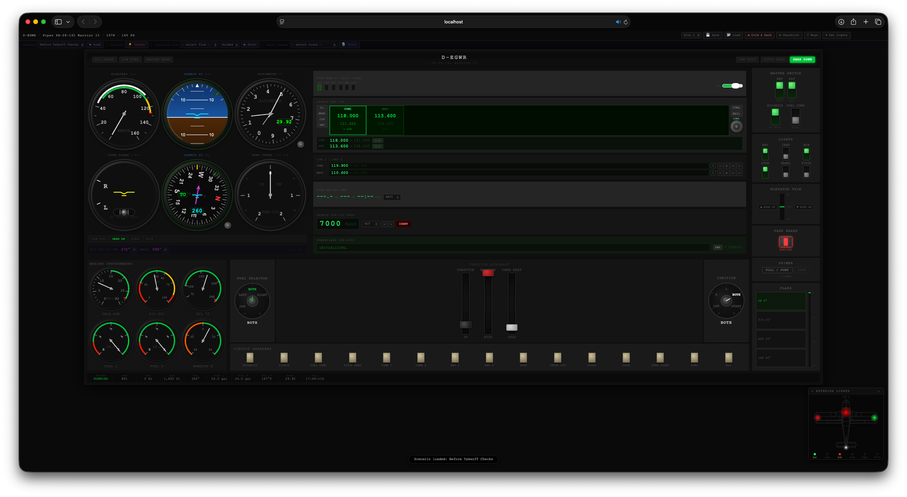
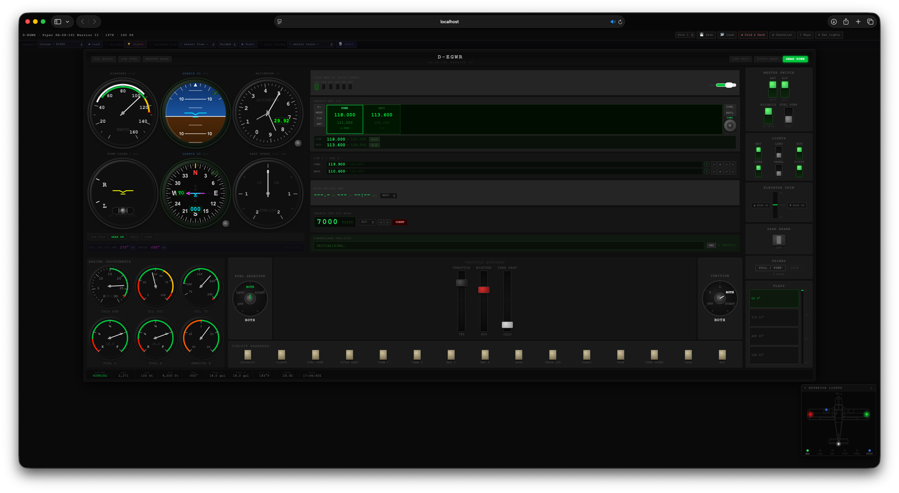

# D-EGWR · Piper PA-28-161 Warrior II · Chairflight Simulator

An interactive, browser-based chairflight trainer for the Piper PA-28-161 Warrior II (D-EGWR, 1978, Lycoming O-320, 160 hp). Built for procedural rehearsal — engine start flows, runup checks, circuit patterns — without a full physics engine.

> **Chairflying** means working through cockpit procedures at a desk, heads-down, exactly as you would in the aircraft. No motion platform needed; the value is in building motor memory and procedure flow.

---

## Screenshots






---

## Getting Started

No build step. No dependencies. Open the file directly in a modern browser:

```
open index.html          # macOS
start index.html         # Windows
xdg-open index.html      # Linux
```

Or serve locally if you prefer (needed for some browsers' audio autoplay):

```bash
# Python 3
python3 -m http.server 8080
# then open http://localhost:8080
```

**Browser requirements:** Chrome 90+ / Firefox 88+ / Safari 15+ — any browser with Web Audio API and Canvas 2D support.

---

## Features

### Instrument Panel
All instruments are Canvas-drawn and update every animation frame.

| Instrument | Notes |
|---|---|
| Garmin G5 PFD (AI) | Bank / pitch display, powered by Avionics Master |
| Garmin G5 HSI | Rotating compass rose + VOR CDI with TO/FROM flag |
| Airspeed Indicator | PA-28-161 V-speed arcs (Vso 44, Vs1 51, Vfe 106, Vno 110, Vne 127 kt) |
| Altimeter | Three-needle, Kollsman window; QNH setting affects indicated altitude |
| Vertical Speed Indicator | ±2000 fpm, non-linear scale |
| Turn Coordinator | Miniature airplane + inclinometer ball |
| Tachometer | 0–3000 RPM, green arc 1500–2750 |
| Oil Temperature | °F, green arc 100–245 |
| Oil Pressure | PSI, colour-coded arcs |
| Fuel Gauges (L / R) | 0–24 gal each |
| Ammeter | Charge/discharge |
| Garmin GNS 430 | COM1/NAV1 frequency display, switchable active/standby |

### Engine Simulation
- Lycoming O-320 model: RPM spool rate, oil warm-up, fuel flow
- Mixture leans automatically at altitude (>8000 ft rich penalty)
- Carb heat causes ~5% RPM drop
- Single-magneto operation causes ~6% RPM drop; both magnetos failed stops engine
- Electric auxiliary fuel pump with battery and CB interlock
- Oil pressure rises within 30 s of start, falls on shutdown

### Altimeter / QNH
Scroll the **BARO** knob (bottom-left of instrument panel) to set QNH. Each 0.01 inHg = 10 ft change in indicated altitude. Click the knob to snap to standard (29.92 inHg). The Kollsman window and all altitude readouts update in real time.

### Audio
Web Audio API engine sound: two detuned sawtooth oscillators + low-pass filter. Pitch tracks RPM exactly (Lycoming O-320 firing frequency = RPM / 30 Hz). Volume controlled by the KMA audio panel knob. Sound starts on first interaction (browser autoplay policy).

### VOR / CDI
The G5 HSI CDI deflects based on the **OBS** course selector and the simulated **VOR RADIAL** (the radial the aircraft is currently on). Rotate OBS and RADIAL knobs to practice intercepting courses and tracking inbound/outbound. TO/FROM flag reverses CDI sensing automatically.

### Circuit Breakers
All 15 CBs are functional. Tripping a CB kills the downstream system:
- **GYRO** → G5 HSI goes dark
- **TURN COORD** → TC goes dark
- **AVIONICS** → G5 HSI, G5 PFD, GNS 430 go dark
- **PITOT HEAT** → pitot heat ineffective even if switch is ON
- **LIGHTS** → no amperage draw from nav/landing lights
- **FUEL PUMP** → aux pump draws no current / provides no pressure
- **COMM 1/2, NAV 1/2, XPDR, TRIM, FLAPS, INSTR LTS, ELT** wired

### Training Tools

#### Scenario Presets
One-click cockpit states via the training bar at the top. Available scenarios:

| Scenario | Description |
|---|---|
| Ready to Start | Battery / alternator on, mixture rich, throttle 12%, parked at EDMA (1493 ft) |
| Engine Running — Idle | Engine at 700 RPM, avionics on, STBY transponder |
| Before Takeoff Checks | Engine warm, runup ready, lights on, ALT transponder |
| Cruise — FL085 | 2350 RPM, mixture 65%, IAS 105 kt, 8500 ft |
| Downwind Leg (RWY 26) | Flaps 10, 2000 ft, 90 kt, landing light on |
| Short Final (RWY 26) | Flaps 40, 350 ft, 70 kt, −600 fpm |

#### Failure Injection
Click **⚡ Inject** to open the instructor panel. Toggle any failure on/off without disrupting other systems. Available failures:

| Failure | Effect |
|---|---|
| Engine Failure | Fuel selector → OFF |
| Alternator | Alternator offline, battery drain begins |
| Vacuum / Gyro | GYRO CB trips, G5 HSI dark |
| Turn Coordinator | TURN COORD CB trips |
| Left Magneto | magFailL flag — RPM drop on BOTH; engine stops on L alone |
| Right Magneto | magFailR flag — RPM drop on BOTH; engine stops on R alone |
| COM1 Radio | COMM 1 CB trips |
| Low Fuel | Both tanks → 3.5 gal (low-fuel annunciator fires) |

#### Guided Procedure Flows
Select a flow and click **▶ Start**. The current checklist item is highlighted on the panel with a pulsing green outline and auto-advances when the condition is met.

| Flow | Steps |
|---|---|
| Engine Start | 13 steps — fuel, masters, mixture, throttle, fuel pump, carb heat, start, oil pressure check, avionics |
| Before Takeoff | 18 steps — parking brake, runup (magneto check, carb heat), lights, transponder |
| Engine Shutdown | 11 steps — idle, avionics off, mixture cut, engine stop, magneto off, masters off |

---

## Controls

### Keyboard Shortcuts
| Key | Action |
|---|---|
| `B` | Battery Master toggle |
| `A` | Alternator toggle |
| `V` | Avionics Master toggle |
| `M` | Magneto step (OFF → R → L → BOTH → START → OFF) |
| `T` / `G` | Throttle +5% / −5% |
| `Y` / `H` | Mixture +5% / −5% |
| `C` | Carb Heat toggle |
| `F` | Fuel Pump toggle |
| `P` | Parking Brake toggle |
| `N` | Nav Lights toggle |
| `L` | Landing Light toggle |
| `S` | Strobes toggle |
| `[` / `]` | Trim nose-down / nose-up |

### Mouse / Touch
| Control | Interaction |
|---|---|
| Throttle / Mixture / Carb Heat levers | Drag up/down **or** scroll wheel |
| Magneto / Fuel Selector knobs | Scroll wheel, or click ◄ / ► arrows |
| BARO knob | Scroll to adjust ±0.01 inHg; click for 29.92 STD |
| HDG / HI knob | Scroll to adjust heading / HSI sync |
| OBS knob | Scroll ±1°; click to sync to current heading |
| VOR RADIAL knob | Scroll to simulate radial aircraft is on |
| GNS 430 outer knob | Scroll to tune frequency ±1 MHz |
| GNS 430 inner knob | Scroll to tune frequency ±0.025 MHz |
| GNS 430 FLIP button | Swap active ↔ standby |
| COM2 / NAV2 knobs | Same pattern |
| Transponder MODE | Click cycle OFF → STBY → ON → ALT |
| Transponder code | Scroll each digit |
| Transponder IDENT | Click |
| Circuit Breakers | Click to trip / reset |
| Parking Brake | Click handle |
| Volume knob | Scroll |

---

## File Structure

```
PIperPA28/
├── index.html          # Single HTML file — all layout and markup
├── css/
│   └── main.css        # All styles — cockpit, instruments, panels
├── js/
│   ├── audio.js        # Web Audio engine sound synthesis
│   ├── state.js        # Single source of truth + save/load (localStorage)
│   ├── instruments.js  # All Canvas drawing functions
│   ├── systems.js      # Engine / electrical / fuel tick loop
│   ├── controls.js     # Event wiring for every cockpit control
│   ├── scenarios.js    # One-click scenario presets
│   ├── failures.js     # Instructor failure injection panel
│   ├── flows.js        # Guided checklist flows with live highlighting
│   └── app.js          # Init + requestAnimationFrame loop
├── screenshots/        # Add screenshots here
└── D-EGWR/             # Reference documents for the real aircraft
```

Script load order matters (all global scope, no modules):  
`audio → state → instruments → systems → controls → scenarios → failures → flows → app`

---

## Save / Load

Up to 5 save slots stored in `localStorage`. Click **💾 Save** / **📂 Load** in the top bar. Slots are per-browser and survive page refreshes. The **↺ Cold & Dark** button resets to default state without affecting saved slots.

---

## Known Limitations

- No actual flight physics — airspeed, altitude, heading, and VSI are scenario parameters set at load time (chairflying intent by design).
- VOR simulation uses a knob-controlled radial rather than computed aircraft position.
- Engine start does not require primer (simplified for procedure rehearsal).
- Fuel flow burns from tanks in real time; scenarios start with full tanks unless specified.

---

## Reference Aircraft

**D-EGWR** — Piper PA-28-161 Warrior II, 1978, based at EDMA (Augsburg Airport, 1493 ft MSL).  
Engine: Lycoming O-320-D3G, 160 hp, fixed-pitch propeller.

Reference documents in `D-EGWR/`.
